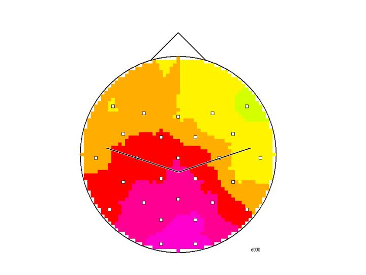
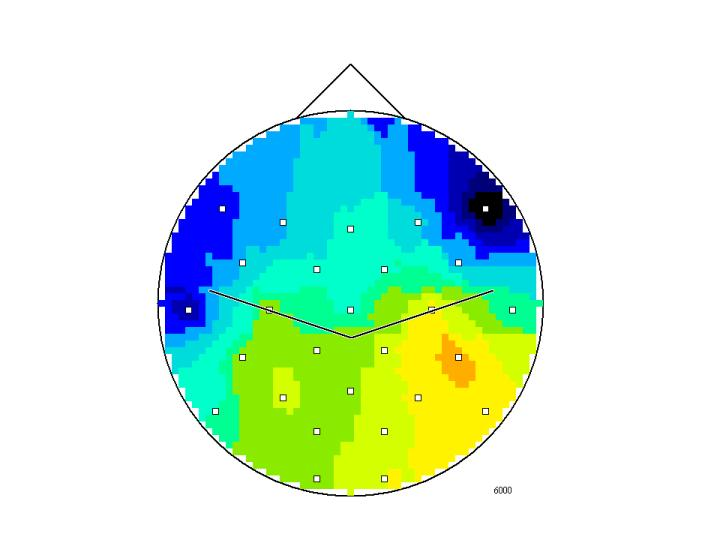

# ERD_maps_2001
ERD maps and animated maps, *low* vs. *high* IQ, where 

$$\\% ERD=\frac{\mu V^2_R-\mu V^2_A}{\mu V^2_R}⋅100,$$

with *alpha power* $\mu V^2$ from the *reference* interval $R$ and *activity* interval $A$, see Neubauer et al. (2002).

Where *power* $P_x$ within given frequency $f$, with upper *alpha* band between $10.70-12.69 Hz$ in $\mathbb C$ is defined by

$$P_x(f)=\Re (a_x)^2+\Im (a_x)^2,$$

c.f. Schrausser (2000).

IQ *low* @ $t=6000 ms$:

IQ *high* @ $t=6000 ms$:

IQ *low*, $t=0-8000 ms$:

IQ *high*, $t=0-8000 ms$:

## References

Neubauer, A., Fink, A., & Schrausser, D. G. (2002). Intelligence and neural efficiency: The influence of task content and sex on brain IQ relationship. *Intelligence, 30*, 515-536. [DOI:10.1016/S0160-2896(02)00091-0](https://doi.org/10.1016/S0160-2896(02)00091-0)

Schrausser, D. G. (2000). *Spectral and Coherence Analysis: Algorithms*. [DOI:10.13140/RG.2.2.28637.90083](http://doi.org/10.13140/RG.2.2.28637.90083)
