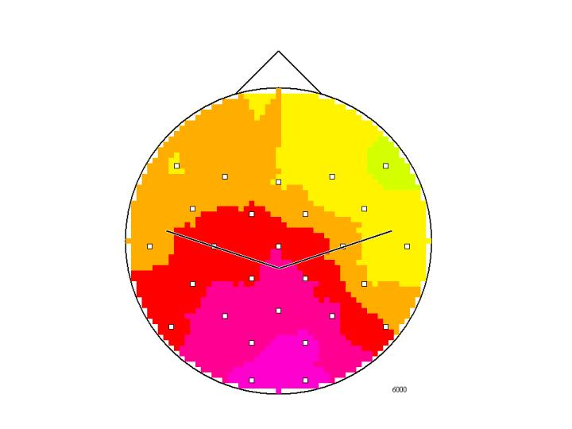
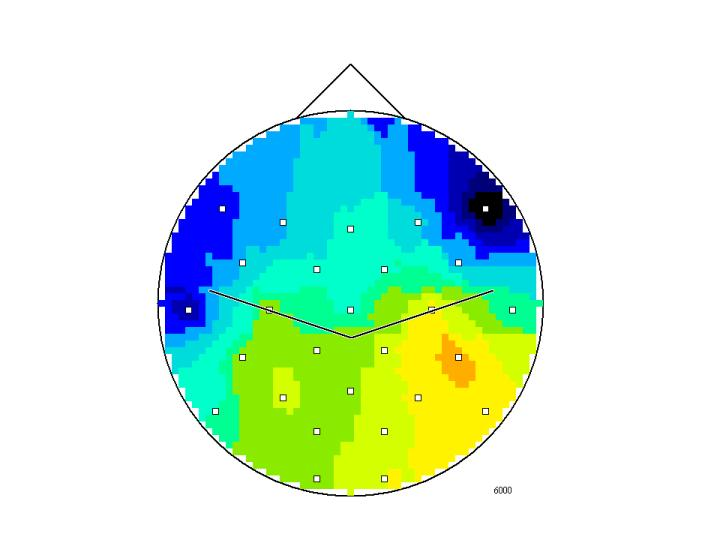

# ERD_maps_2001
ERD maps and animated maps, low vs. high IQ (see Neubauer et al., 2002).

IQ low @ $t=6000 ms$:

IQ high @ $t=6000 ms$:

IQ low, $t=0-8000 ms$

IQ high, $t=0-8000 ms$

## References

Neubauer, A., Fink. A. & Schrausser, D. G. (2002). Intelligence and neural efficiency: The influence of task content and sex on brain IQ relationship. *Intelligence, 30*, 515-536. [DOI: 10.1016/S0160-2896(02)00091-0](https://doi.org/10.1016/S0160-2896(02)00091-0)
